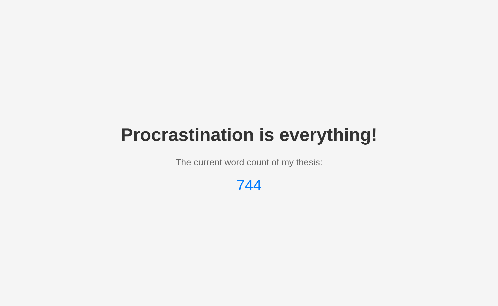

# Word counter

After the fun part of researching, testing and experimenting comes the boring part: Writing that thing. To keep you publicly accountable for your thesis, you can now let the world see your progress via GitHub Pages!

## How to use
1. Host your thesis git repo, where it can be accessed via an HTTP access token. (If you already do that on GitHub, you can directly integrate this workflow in your repo by adjusting the path to your main.tex)
2. Have your `main.tex` at the root of your LaTeX project.
3. Set the following secrets:
  - `HTTP_USERNAME`
  - `HTTP_REPO_URL`
  - `HTTP_TOKEN`
4. In the _Pages_ settings of your repo select _GitHub Actions_ under _Source_.

_The workflow will run every hour!_
